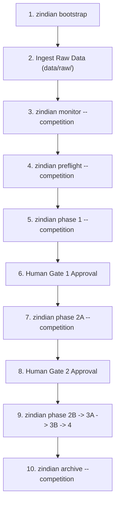

# Zindian Orchestrator — Quick Start Guide

This guide walks you through initializing a competition workspace, running preflight verification, executing the 5-phase competition pipeline, and tracking experiments using the **Zindian Orchestrator CLI** and **Preflight Engine** aligned with **Source of Truth v2.9**.

---

## 1. Environment & Setup

Activate your Python environment and verify installation:

* **Unix/macOS:**
  ```bash
  source .venv/bin/activate
  ```
* **Windows (PowerShell / Git Bash):**
  ```powershell
  .venv\Scripts\Activate.ps1
  ```

Install pinned dependencies:
```bash
python -m pip install -r requirements.txt
```

Verify repository health with the automated test suite:
```bash
pytest tests/ -q
```

---

## 2. Bootstrapping & Multi-Tenancy Resolution

Zindian Orchestrator enforces **competition-aware multi-tenancy**. All competition-specific state, configs, ledger DBs, and data artifacts reside inside `competitions/<slug>/`.

### Competition Path Resolution Order
When executing CLI commands or running skills, `resolve_competition_paths()` resolves the active competition in the following strict order:
1. Explicit `--competition <path_or_slug>` CLI flag or function `slug` parameter.
2. Current working directory (if executing from inside `competitions/<slug>/`).
3. `ZINDIAN_COMPETITION_SLUG` (or `COMPETITION_SLUG` / `ZINDIAN_COMPETITION`) environment variable.
4. `.env` file entry defining `ZINDIAN_COMPETITION_SLUG`.
5. Auto-detect when **exactly one** `competitions/*/SKILL_STATE.json` exists.

> [!IMPORTANT]
> **F4 Ambiguity Hard-Fail Rule**: If multiple `competitions/*/` folders exist on disk and no explicit slug, environment variable, `.env` file, or working directory is specified, the orchestrator **hard-fails with a `ValueError`** (`require_competition=True`). It does **not** dynamically pick a competition based on `last_updated` timestamps, preventing accidental state corruption or cross-competition pollution.

> [!IMPORTANT]
> **Zindi API Slug Requirement**: The competition slug you choose during initialization/bootstrapping (e.g. `one-step-ahead-of-drought-forecasting-global-water-storage-challenge`) MUST match the competition URL path identifier on Zindi (e.g., `https://zindi.world/competitions/<slug>`) exactly. This is because the Zindi Client API wrapper uses this slug directly (as `challenge_id`) to perform network requests for downloading datasets, syncing the leaderboard, retrieving submission boards, and uploading submission CSV files.

### Step 2.1: Initialize the Competition Workspace
Run `tabula init` or `zindian-cli bootstrap` with your competition slug:

```bash
# Using Tabula CLI
python -m tabula init one-step-ahead-of-drought-forecasting-global-water-storage-challenge --yes

# Or using Zindian CLI
python -m zindian.cli bootstrap one-step-ahead-of-drought-forecasting-global-water-storage-challenge --yes
```

This creates the competition structure:
```
competitions/one-step-ahead-of-drought-forecasting-global-water-storage-challenge/
├── challenge_config.json   # Competition contract
├── SKILL_STATE.json        # State & Human Gate memory
├── data/
│   ├── raw/                # Train.csv, Test.csv, SampleSubmission.csv
│   └── processed/          # Engineered features & OOF arrays
├── reports/
│   ├── experiments.db      # Isolated DuckDB experiment ledger
│   ├── summaries/          # Consolidated phase summaries (Markdown and JSON metadata)
│   ├── diagnostics/        # Literature caches, hypotheses, and EDA reports
│   ├── audits/             # Legality policies, SHAP analysis, and reproducibility audits
│   │   └── preflight/      # Preflight compliance reports (INIT/ENFORCE timestamped JSON)
│   └── sessions/           # Session-scoped logs
├── notebooks/
└── submissions/            # Submission CSVs
```

And automatically sets your active competition in `.env`:
```env
ZINDIAN_COMPETITION_SLUG=one-step-ahead-of-drought-forecasting-global-water-storage-challenge
```

---

## 3. Competition Data Intake & Execution Sequence

### End-to-End Command Order for a New Competition

When starting a new competition, execute commands in the following exact operational sequence:



#### Step 3.1: Bootstrap Competition Workspace
Initialize the competition folder structure:
```bash
python -m zindian.cli bootstrap <competition-slug>
```

#### Step 3.2: Ingest Raw Data Files
Move raw competition files (`Train.csv`, `Test.csv`, `SampleSubmission.csv`, `data_dictionary.csv`) into `competitions/<slug>/data/raw/`:
```bash
cp /path/to/downloads/Train.csv competitions/<slug>/data/raw/
cp /path/to/downloads/Test.csv competitions/<slug>/data/raw/
cp /path/to/downloads/SampleSubmission.csv competitions/<slug>/data/raw/
```

#### Step 3.3: Fetch Competition Intelligence (`zindian monitor`)
Scrape Zindi rules, evaluation metric, submission limits, and discussion board flags to populate `challenge_config.json`:
```bash
python -m zindian.cli monitor --competition <slug>
```

#### Step 3.4: Verify Environment Readiness (`zindian preflight`)
Run the preflight compliance engine to confirm credentials, environment, raw files, and configuration validity:
```bash
python -m zindian.cli preflight --competition <slug>
```

#### Step 3.5: Execute Phase 1 (Integrity, Intake, EDA, & CV Architecture)
Run Phase 1 to calculate MD5 data hashes, resolve target columns against `Train.csv` / `data_dictionary.csv`, generate EDA reports, and lock the CV strategy:
```bash
python -m zindian.cli phase 1 --competition <slug>
```

#### Step 3.6: Authorize Human Gate 1
Review EDA and CV reports in `reports/diagnostics/` and approve Gate 1 in `competitions/<slug>/SKILL_STATE.json`:
```json
"human_gate_1_approved": true
```

#### Step 3.7: Execute Phase 2A (Policy Gate & Data Preprocessing)
Run policy checks and data cleaning:
```bash
python -m zindian.cli phase 2A --competition <slug>
```

#### Step 3.8: Execute Phase 2B (Baseline Anchor Model & Feature Engineering)
Extract features and train the initial baseline anchor model under the locked CV strategy:
```bash
python -m zindian.cli phase 2B --competition <slug>
```

#### Step 3.9: Authorize Human Gate 2
Approve the baseline model branch in `SKILL_STATE.json`:
```json
"human_gate_2_anchor-baseline_approved": true
```

#### Step 3.10: Execute Pipeline Phases 3A through 4
Run SHAP audits, metric calibration, pseudo-labeling, ensembling, and final inference generation:
```bash
python -m zindian.cli phase 3A --competition <slug>
python -m zindian.cli phase 3B --competition <slug>
python -m zindian.cli phase 4 --competition <slug>
```

#### Step 3.11: Submit & Archive Competition
Submit your final predictions to Zindi via `zindian submit`, then update the cross-competition history log and archive the run:
```bash
python -m zindian.cli archive <slug>
```

---

## 4. Initialize Competition Experiment Ledger

Provision the competition-isolated DuckDB audit ledger (`experiments.db`), which tracks all model variants, OOF scores, gate outcomes, and submission metadata:

```bash
python -m zindian.cli init-ledger
```
> **Ledger Path**: `competitions/one-step-ahead-of-drought-forecasting-global-water-storage-challenge/reports/experiments.db`

---

## 5. Preflight Compliance Engine

Before executing pipeline phases, run the preflight verification check to guarantee environment lock and Source of Truth (SoT v2.9) compliance.

```bash
python -m zindian.cli preflight --competition competitions/one-step-ahead-of-drought-forecasting-global-water-storage-challenge --non-interactive
```

### Preflight Operational Modes

1. **INIT Mode**: Triggers when `challenge_config.json` is unpopulated.
   - Validates workspace directory structure and write permissions.
   - Verifies raw dataset presence (`Train.csv`, `Test.csv`).

2. **ENFORCE Mode**: Triggers when `challenge_config.json` is configured.
   - **Schema Completeness**: Validates 29 required top-level configuration keys.
   - **Human Gate Memory**: Audits standard human gate keys (`human_gate_1_approved`, `human_gate_3_approved`, `human_gate_4_approved`, `human_gate_5_selection`, and flat `human_gate_2_<variant>_approved` booleans).
   - **AST Static Code Audits**:
     - `scan_automl_imports`: Hard prohibition of AutoML imports (`auto-sklearn`, `tpot`, `h2o`, etc.).
     - `scan_cross_skill_imports`: Blocks cross-skill module dependencies.
     - `scan_oof_cv_strategy_tags`: Verifies all `write_oof_record()` calls pass `cv_strategy_id`.
   - **Section 1 Assumptions Audit**: Validates A1 (scoping), A2 (tabular format), A3 (submission budget $\le 30$), A4 (target presence), A5 (zero hardcoded competition strings), A6 (atomic state writes), A8 (GroupKFold spatial routing), and A9 (safe `.get()` reads).

---

## 6. Pipeline Phase Execution & Variant Management

Execute the orchestrator DAG sub-phases sequentially using `zindian-cli phase`:

```bash
# Phase 1: Competition Fingerprint & Data Integrity
python -m zindian.cli phase 1

# Phase 2A: Feature Preprocessing & Imputation
python -m zindian.cli phase 2A

# Phase 2B: Baseline Anchor Model Training (No --variant)
python -m zindian.cli phase 2B
# -> Trains baseline anchor model (skill_08), prompts Human Gate 1 to approve baseline.

# Phase 2B: Feature Variant Branch Training (--variant <name>)
python -m zindian.cli phase 2B --variant lgb_hydrological_lags
# -> Checks Gate 1, skips skill_08 anchor training, runs skill_07 feature engineering,
#    registers variants/lgb_hydrological_lags.json, trains variant model, and prompts Human Gate 2.

# Phase 3A: Targeted Variant Generalization Audit (SHAP & MI Audit)
python -m zindian.cli phase 3A --variant lgb_hydrological_lags
# -> Loads variant features and model sidecars to run leak detection, SHAP audit, and calibration.

# Phase 3B: Model Fusion & Human Gate 3 (Oracle Fusion)
python -m zindian.cli phase 3B
# -> Auto-reads registered & approved variants from SKILL_STATE.json to execute Oracle Fusion.

# Phase 4: Final Inference, Reproducibility Audit, and Submission Selection
python -m zindian.cli phase 4
# -> Generates test predictions using promoted variant/fusion ensemble from SKILL_STATE.json.
```

### Complete Skill & Phase Architecture Matrix (All 25 Skill Modules)

The orchestrator manages **25 skill modules** across 23 contiguous slots (`skill_00` to `skill_22`). Skills execute sequentially within DAG sub-phases or asynchronously as background daemons:

| Skill Slot & Module Name | Phase Mapping | Type | Primary Role & Pipeline Connection |
| :--- | :--- | :--- | :--- |
| **`skill_00_zindi_monitor.py`**<br>*(Shim: `skill_00_discussion_monitor.py`)* | Sidecar / Phase 0 Daemon | **Dynamic** | Polls Zindi platform for rules, discussions, and submission limits; updates `community_signals` and compliance state. |
| **`skill_01_integrity.py`** | **Phase 1** | **Static** | Computes MD5 checksums (`Train.csv`, `Test.csv`, `SampleSubmission.csv`), checks tabular extensions, audits environment hashes. |
| **`skill_02_intake.py`** | **Phase 1** | **Dynamic** | Reads raw headers, populates `challenge_config.json` (targets, spatial/temporal columns, metric) before Phase 1 config lock. |
| **`skill_03_legality.py`** | **Phase 1** (`policy_writer`) & **Phase 2A** (`policy_gate`) | **Static** | **Split Execution**: `policy_writer()` synthesizes compliance rules → `reports/audits/feature_policy.json` + `reports/audits/legality_report.md`; `policy_gate()` blocks banned features. |
| **`skill_04_eda.py`** | **Phase 1** | **Static** | Computes target std ($\sigma_y$), missingness (MCAR/MNAR), correlation matrix; offloads heavy dicts to `reports/diagnostics/eda_report.json` + `reports/diagnostics/eda_summary.md`. |
| **`skill_05_cv.py`** | **Phase 1** | **Dynamic** | Configures CV strategy. Routes spatial datasets (`lat`/`lon`) to 3D sphere projected `KMeans` spatial clustering with 50 km buffer exclusion. |
| **`skill_06_preprocessing.py`** | **Phase 2A** | **Static** | Applies MNAR missingness indicators, median/mode MCAR imputation, and drops constant columns (`data/processed/`). |
| **`skill_07_features.py`** | **Phase 2B** (Dual Call) | **Dynamic** | Synthesizes baseline/variant features, integrates Skill 20 sidecar hypotheses, registers `variants/<name>.json`, trains variant models. |
| **`skill_08_anchor.py`** | **Phase 2B** | **Dynamic** | Trains baseline anchor model, computes OOF predictions tagged with `cv_strategy_id`, sets `anchor_oof_score`, prompts **Human Gate 1**. |
| **`skill_09_calibration.py`** | **Phase 3A** | **Dynamic** | Fits foldwise Platt Scaling / Isotonic Regression for classification, or residual variance scaling for regression tasks. |
| **`skill_10_shap.py`** | **Phase 3A** | **Dynamic** | Computes per-fold validation SHAP values; enforces `shap_leak_threshold` (3.0 ratio); writes `reports/audits/shap_analysis.json` + `reports/audits/shap_summary.md`. |
| **`skill_11_gate.py`** | **Phase 3B** | **Dynamic** | Evaluates variants using Nadeau-Bengio inverse-variance weighting & 1-SE margin against 3 baseline modes (`anchor`, `challenged`, `augmented`). |
| **`skill_12_metric.py`** | **Phase 3A** | **Static** | Computes `MAE_naive` benchmark, target-scaled thresholds ($\sigma_y$), and Nadeau-Bengio fold sample variance correction factors ($ddof=1$). |
| **`skill_13_oracle_fusion.py`**<br>*(Shim: `skill_13_ensemble.py`)* | **Phase 3B** | **Dynamic** | Prunes collinear predictions (correlation $>0.95$), computes Nelder-Mead / Ridge blend weights, prompts **Human Gate 3**. |
| **`skill_14_inference.py`** | **Phase 4** | **Dynamic** | Generates test predictions using two-mode feature transformers (`mode="inference"`). Enforces bounds $[y_{\min}, y_{\max}]$ and $[0.0, 1.0]$. |
| **`skill_15_reporter.py`** | **Phase 1** (and all boundaries) | **Static** | Logs phase events, computes resource telemetry (time/memory/carbon), generates markdown phase summary reports in `reports/summaries/`, and writes session-scoped event logs to `reports/sessions/`. |
| **`skill_16_submit.py`** | **Phase 4** | **Dynamic** | Enforces 2-tier submission budget guard (daily/total limits), submits formatted CSV via Zindi API client, and syncs leaderboard scores. |
| **`skill_17_governance.py`** | **Phase 4** | **Static** | Applies structural state lock (`_apply_structural_lock`). Verifies approvals for Human Gates 1, 2, 3, 4, and 5 before submission. Writes selection report to `reports/audits/final_selections.json`. |
| **`skill_18_librarian.py`** | Deep Research Sidecar | **Dynamic** | Asynchronously queries literature APIs (ArXiv, Semantic Scholar) for domain ML strategies. Writes exclusively to `reports/diagnostics/literature_cache.json` and `reports/diagnostics/domain_hypotheses.json` (S11 root dual-writes resolved — no root copies). |
| **`skill_19_code_miner.py`** | Deep Research Sidecar | **Dynamic** | Mines Kaggle/GitHub competitive code patterns using Gemini LLM queries (`reports/ml_priorart.json`). |
| **`skill_20_scientist.py`** | Deep Research Sidecar | **Dynamic** | Formulates and empirically validates feature hypotheses against raw dataset schema. Writes exclusively to `reports/diagnostics/validated_hypotheses.json` and `reports/diagnostics/failed_hypotheses.json` (S11 root dual-writes resolved — no root copies). |
| **`skill_21_pseudo_label.py`** | **Phase 3B** | **Dynamic** | Generates pseudo-labels on test data for high-confidence predictions; initiates retraining loop under `_augmented` namespace contract. |
| **`skill_22_reproducibility_audit.py`** | **Phase 4** | **Static** | Performs 3-tier fingerprint audit (file MD5 hashes, OOF strategy tags, lockfile integrity); writes `reports/audits/reproducibility_audit.json`. |

---

## 7. Querying the Competition Ledger

Query experiments and submission records logged in DuckDB:

```bash
# List all logged experiments
python -m zindian.cli ledger experiments

# Display the best performing model variant
python -m zindian.cli ledger best

# Display all model variants that passed Human Gate 2
python -m zindian.cli ledger passed

# Display failed or blocked variants
python -m zindian.cli ledger failed

# Display submission log history
python -m zindian.cli ledger submissions
```

---

## 8. CLI Command Quick Reference (21 Commands)

| Command Category | Command | Description |
| :--- | :--- | :--- |
| **Pipeline Control** | `phase <1\|2A\|2B\|3A\|3B\|4>` | Executes specified pipeline phase after preflight check |
| **Status & Sync** | `status` | Prints active competition, current phase, OOF/LB scores, and budget |
| | `sync` | Synchronizes state with git branch and Zindi board |
| | `report` | Generates Phase Summary Markdown Report (`skill_15`) |
| **Preflight & Audit** | `preflight` | Runs preflight compliance and environment checks |
| | `preflight-sim` | Runs preflight simulation across fixture competitions |
| | `audit` | Runs end-to-end reproducibility audit (`skill_22`) |
| | `audit-framework` | Runs workspace and environment audit script |
| **Workspace & Ledger**| `bootstrap <slug>` | Bootstraps a new competition workspace |
| | `init-ledger` | Provisions DuckDB `experiments.db` ledger |
| | `ledger <subcommand>` | Queries DuckDB ledger (`experiments`, `best`, `passed`, `failed`, `submissions`) |
| **Submission & Zindi** | `submit <file>` | Validates and submits prediction CSV to Zindi (`skill_16`) |
| | `submissions` | Displays Zindi submission board history |
| | `leaderboard` | Pulls current Zindi competition leaderboard |
| **Utilities** | `verify-state` | Validates SKILL_STATE schema integrity |
| | `verify-phase-b` | Verifies Phase B package hardening assertions |
| | `write-oof-meta` | Writes per-OOF metadata sidecars alongside CSVs |
| | `compile-requirements`| Recompiles pinned `requirements.txt` via `pip-compile` |
| | `check-deployment` | Audits SKILL_STATE storage optimization |
| | `archive <slug>` | Archives competition workspace to `.tar.gz` |

---

**Source of Truth Version:** v2.9
**Last Updated:** August 2026
